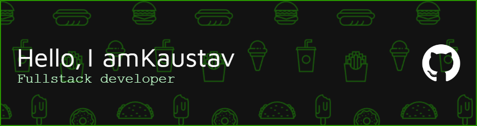

 Group 1 (1)
<!--    -->
  

---

# Hi there, I'm Kaustav 👋

🔭 I’m currently working on exciting full-stack projects using the MERN stack.  
🌱 I’m constantly learning about advanced React patterns, serverless architectures, and microservices.  
👯 I’m looking to collaborate on open-source MERN stack projects.  
🚀 Recent project: [Elephant Juice](https://elephantjuice.org) - Love, Space, and Technology combined!
💡 **Also passionate about Machine Learning & Deep Learning!** Built a CNN-based project for my Bachelor's final year that predicts [Colorization of Black and White Images using CNN and GAN] 📊🤖

💬 Ask me about web development, React performance, backend APIs, and cloud deployments.  
📫 How to reach me: [LinkedIn](https://www.linkedin.com/in/kaustav-dey-73992a224/)
⚡ Fun fact: I can build UIs smoother than a shooting star! 🌠

---

## 🛠️ Tech Stack
- **Frontend**: React.js, Next.js, Redux, TailwindCSS
- **Backend**: Node.js, Express.js
- **Database**: MongoDB, SQL Server
- **Tools & Platforms**: Git, Docker, Vercel, AWS (Basics)

---

## 📈 GitHub Stats

---

---

<!---->

